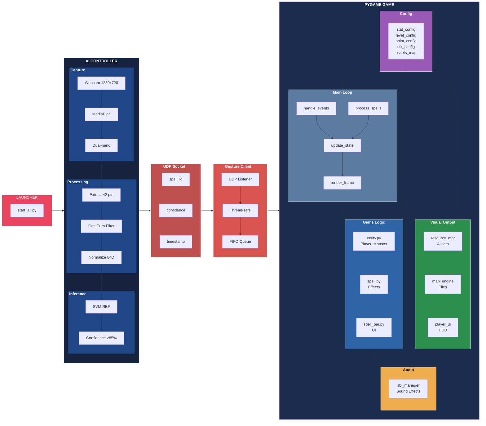

# SpellMaster - System Architecture

## Overview

When `start_all.py` is executed, it launches 2 independent processes communicating via UDP:

- **Process 1 (AI Controller)**: Webcam capture, MediaPipe hand detection, ML gesture prediction, UDP broadcast
- **Process 2 (Pygame Game)**: Game loop at 60 FPS, spell casting, monster AI, wave system, rendering

## Architecture Diagram

## Module Descriptions

### AI Controller Side

| Module | File | Description |
|--------|------|-------------|
| Gesture Server | `gesture_server.py` | Main server loop: webcam capture, hand detection, ML prediction, UDP broadcast |
| Spell Recognizer | `spell_recognizer.py` | MediaPipe hand landmark extraction, normalization, sklearn model inference |
| One Euro Filter | `utils/one_euro_filter.py` | Adaptive low-pass filter to reduce MediaPipe landmark jitter |
| Config | `config.py` | Global constants, paths, colors, thresholds |

### Pygame Game Side

| Module | File | Description |
|--------|------|-------------|
| Gesture Client | `gesture_client.py` | UDP listener thread, receives spell events, queues them for game loop |
| Main Game | `main_pygame.py` | Game loop at 60 FPS: events, state update, rendering, wave system |
| Entity | `entity.py` | Player, Monster, Statue, Portal classes with state machines and collision |
| Spell | `spell.py` | SpellEffect (animation + damage), SpellManager (cast logic, special effects) |
| Spell Bar | `spell_bar.py` | UI bar with 10 spell icons, highlight, kill counter, unlock system |
| Map Engine | `map_engine.py` | Tile-based map rendering from map_data |
| Resource Manager | `resource_manager.py` | Centralized asset loading: images, sounds, sprite sheets |
| SFX Manager | `sfx_manager.py` | Sound effects playback with volume, speed, trim, looping |
| Player UI | `player_ui.py` | HP and Mana container-based HUD with blink animations |

### Config Files

| File | Description |
|------|-------------|
| `stat_config.json` | Player stats, spell damage/effects, monster stats, UI sizing |
| `level_config.json` | Portal positions, wave definitions (monster types + spawn delays) |
| `animations_config.json` | Sprite sheet paths, grid layout, frame counts for all entities |
| `sfx_config.json` | Sound effect paths, volume, speed, trim, loop settings |
| `assets_map.json` | Map tile sprite sheets and decoration asset definitions |
